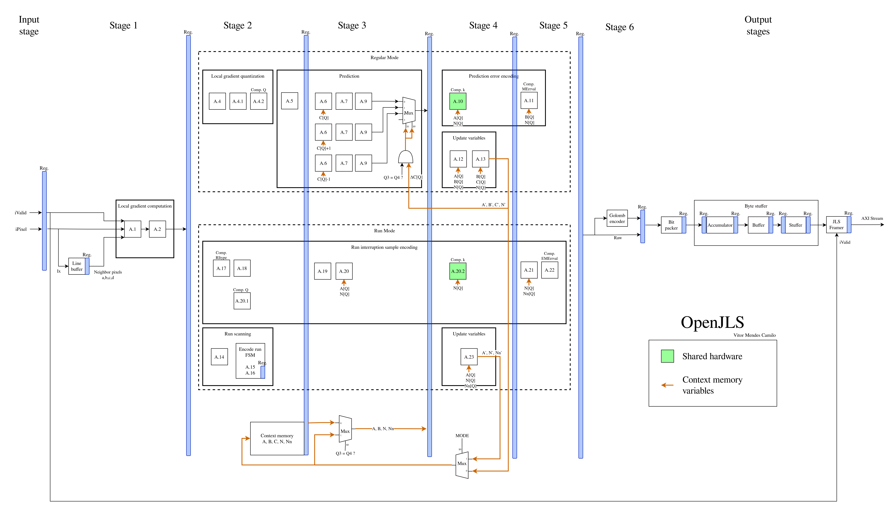
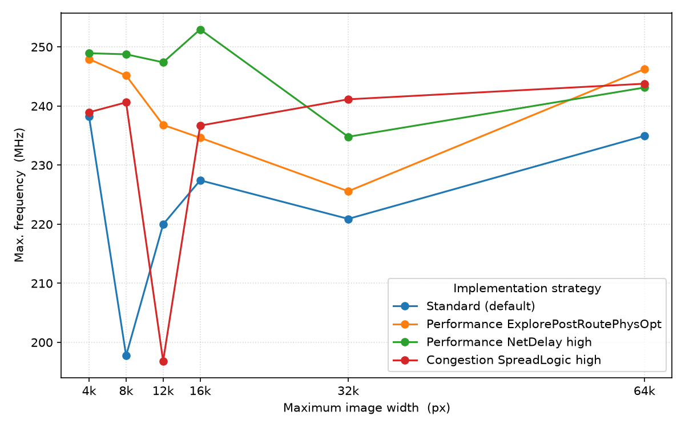
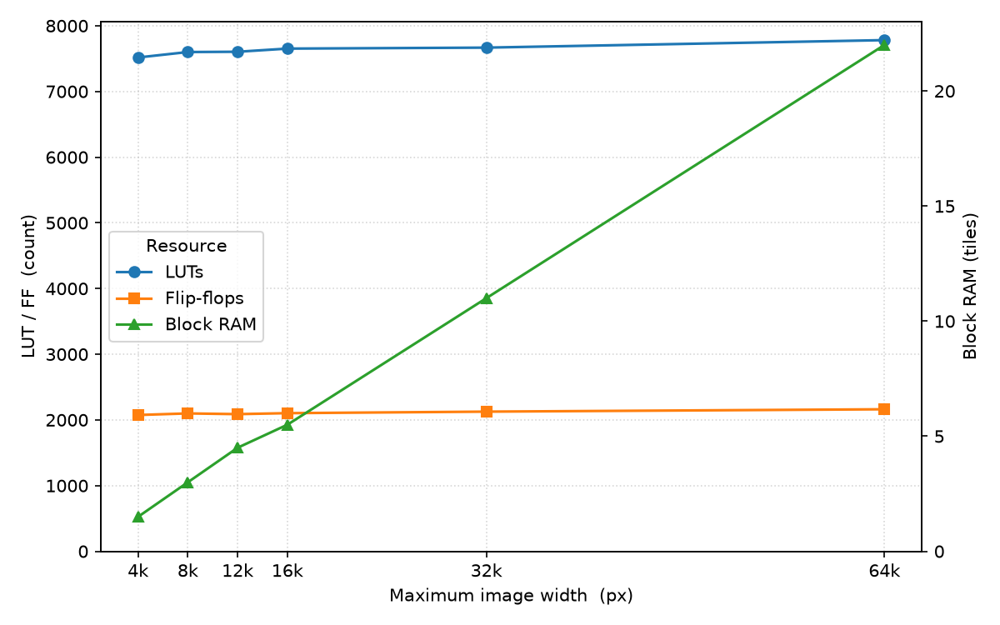

# OpenJLS

OpenJLS is a **JPEG-LS encoder IP core for FPGAs** for real-time image compression.

It implements the JPEG-LS standard (described by ISO/IEC 14495-1 or ITU-T T.87) — a low-complexity lossless image codec with compression ratios comparable to JPEG 2000 lossless at a fraction of the computational cost, and no external memory required.

OpenJLS reaches ~240 MHz on a Xilinx UltraScale+ ZU7EG (an MPSoC common in space applications) and processes one pixel per clock — ~240 Mpixel/s. It handles single-component (grayscale) data, so a multi-band sensor uses one compressor per band; resource usage is low enough that this stays cheap and runs all bands in parallel, greatly increasing throughput.

OpenJLS is vendor-neutral by construction (RTL-only, on open-logic memory primitives) and characterized on Xilinx.

---

## Resources

- **[Datasheet (PDF)](Docs/datasheet/openjls_datasheet.pdf)**
- **[Verification report](https://vitormendesc.github.io/OpenJLS/)**
- **[Interface & integration](#interface)**
- **[Roadmap](Docs/roadmap.md)**
- **[Licensing](#licensing)**

---

## Features

Specifications

- **Compression** — Lossless JPEG-LS
- **Pixel Bit depth** — 8 to 16 bits
- **Components** — Single-component (grayscale)
- **Image size** — Configurable up to 64k × 64k px (minimum 4 × 1)
- **Memory** — Line buffer, as big as image width, on-chip
- **Throughput** — One pixel per clock cycle
- **Interface** — Ready/valid streaming handshake (AXI4-Stream / Avalon-ST compatible)
- **Conformance** — Bit-exact against the ISO/IEC 14495-1 reference and golden-model [CharLS](https://github.com/team-charls/charls)
- **Portability** — Vendor-agnostic VHDL, due to memory-agnostic IPs from [open-logic](https://github.com/open-logic/open-logic)

---

## Verification

OpenJLS is verified by simulation with [NVC](https://www.nickg.me.uk/nvc/) using a layered suite that combines constrained-random self-checking tests, functional coverage, and byte-exact comparison against an independent reference encoder — run at both the RTL and post-synthesis (gate-level) stages:

> **Browse the latest [verification report](https://vitormendesc.github.io/OpenJLS/)** — a published snapshot aggregating the OSVVM and NVC HTML reports and the post-synthesis verification logs. It is updated when the reports are regenerated and committed, not on every push.

| Suite | Status | Test/Cov | Summary |
|---|---|---|---|
| OSVVM suite | PASS | 100% | 36 tests, 129,810 affirmations (module + top control-plane) |
| NVC code coverage | info | 99.8% | Per-DUT-file statement breakdown |
| Golden model | PASS | 100% | 287/287 images byte-exact vs CharLS |
| Post-synth OSVVM | PASS | 100% | Control-plane stress on the gate-level netlist |
| Post-synth golden model | PASS | 100% | 156/156 images byte-exact vs CharLS |

- **OSVVM** — 28 module testbenches check each module against an independent behavioral reference derived from ITU-T T.87; a top-level testbench stresses the control plane (reset injection, backpressure, randomized sizes) with requirements tracking.
- **Coverage** — OSVVM functional coverage plus NVC structural code coverage (99%+ statements).
- **Golden model** — Output bitstream compared byte-exact against [CharLS](https://github.com/team-charls/charls), an independent C++ reference encoder, plus the official ISO/IEC 14495-1 reference vectors.
- **Design contracts** — Embedded PSL assertions (ready/valid and internal handshakes) checked every run.
- **Post-synthesis** — The top-level stress test and a golden-model subset re-run on the synthesized gate-level netlist, confirming synthesis preserved behavior.

**Golden-model dataset.** The corpus is **287 images** pulled from public datasets and exercised across the full datapath:

| Source | Set | Images |
|---|---|--:|
| [USC-SIPI](https://sipi.usc.edu/database/) | Aerials, textures, miscellaneous, sequences | 210 |
| [imagecompression.info](http://imagecompression.info/test_images/) | 8-bit and 16-bit natural photographs | 30 |
| Generated stress probes | Boundary, predictor-adversarial, high-entropy and fuzz patterns | 47 |

The real datasets give natural image statistics from 256×256 up to **39 megapixels** (7216×5412); the generated probes target what real images never reach. [`gen_stress.py`](Verification/Golden%20model/imageprep/gen_stress.py) emits them deterministically (seeded, byte-reproducible), covering:

- **Intermediate bit depths (9–15)** — the only coverage of this range; no natural dataset exists here.
- **Boundary geometries** — smallest legal image (4×1), tall single-column images, and single rows up to 65535×1.
- **Predictor-adversarial content** — checkerboard, stripes, and sparse spikes that defeat the MED predictor every pixel, plus incompressible noise.
- **Tiny-image fuzz batch** — many small randomized images stressing start/end-of-image edges more densely than full-size images can.

---

## Architecture

OpenJLS follows the JPEG-LS encoding pipeline:

1. **Gradient computation** — local gradients from causal pixel neighbors (a, b, c, d)
2. **Context modeling** — gradient quantization into 365 contexts with adaptive bias correction
3. **Prediction** — MED (Median Edge Detector) with context-based bias cancellation
4. **Encoding** — adaptive Golomb-Rice coding for regular mode, run-length encoding for uniform regions
5. **Bitstream packing** — ISO/IEC 14495-1 compliant JPEG-LS output stream

The hardware architecture is based on the optimizations in Mert's [*Key Architectural Optimizations for Hardware Efficient JPEG-LS Encoder*](https://www.researchgate.net/publication/331795298_Key_Architectural_Optimizations_for_Hardware_Efficient_JPEG-LS_Encoder), reworked into a vendor-agnostic, fully pipelined VHDL core.

[`Docs/Requirements.md`](Docs/Requirements.md) is the **source of truth** for the RTL. Every source file under [`Sources/`](Sources/) implements exactly one topic from it — a code segment or written requirement — and is named after that topic. Each and every one of those topics was taken **verbatim from ISO/IEC 14495-1 (ITU-T T.87)**.

---

## Interface

The core is a single entity, `openjls_top`, configured by generics and driven through a pixel-in / bitstream-out streaming interface.

### Generics

| Generic | Range | Description |
|---|:--:|---|
| `BITNESS` | 8–16 | Pixel bit depth. |
| `MAX_IMAGE_WIDTH` | 4–65535 | Largest image width supported; sets the on-chip line-buffer depth. |
| `MAX_IMAGE_HEIGHT` | 1–65535 | Largest image height supported. |
| `OUT_WIDTH` | 48–1024 | Output data-bus width in bits (multiple of 8). |

> `MAX_IMAGE_WIDTH` and `MAX_IMAGE_HEIGHT` set the **compile-time** maximum image size — they size the on-chip line buffer and the dimension counters, so a larger maximum costs more BRAM. They don't pick the size of any given image: the dimensions of each encoded image are selected at **run time** through the `iImageWidth`/`iImageHeight` ports (see [Ports](#ports)), which accept any value from the minimum up to the configured maximum.

### Ports

The streaming ports use a plain **ready/valid handshake**; the *AXIS* column gives the 1:1 AXI4-Stream signal mapping for that ecosystem (Avalon-ST maps the same way at `readyLatency = 0`).

| Port | Dir | Width | AXIS | Role |
|---|:--:|---|:--:|---|
| `iClk` | in | 1 | — | Clock; whole core is synchronous to its rising edge. |
| `iRst` | in | 1 | — | Synchronous reset, active high. Also latches the image dimensions (see below). |
| `iImageWidth` | in | `⌈log2(MAX_IMAGE_WIDTH+1)⌉` | — | Image width in pixels (configuration). |
| `iImageHeight` | in | `⌈log2(MAX_IMAGE_HEIGHT+1)⌉` | — | Image height in pixels (configuration). |
| `iValid` | in | 1 | `TVALID` | Input pixel valid. |
| `iPixel` | in | `BITNESS` | `TDATA` | Input pixel. |
| `oReady` | out | 1 | `TREADY` | Input ready. |
| `oData` | out | `OUT_WIDTH` | `TDATA` | Output bitstream beat. |
| `oValid` | out | 1 | `TVALID` | Output valid. |
| `oKeep` | out | `OUT_WIDTH/8` | `TKEEP` | Valid-byte mask on the final beat. |
| `oLast` | out | 1 | `TLAST` | End of image. |
| `iReady` | in | 1 | `TREADY` | Output ready / downstream backpressure. |

### Integration notes

- **Pixel stream.** Feed pixels in **scan order** — the first row left to right, then the second row, and so on — one per accepted handshake (`iValid and oReady`), each an unsigned value on `iPixel`. The encoder sustains one pixel per clock and deasserts `oReady` *only* under downstream backpressure (`iReady` low). The output bitstream is byte-serial, MSB-first.
- **Image dimensions are configuration, sampled while `iRst` is high** — hold them stable and pulse reset before a new resolution. They latch only during reset, so reset before the first image and whenever the size changes; **no reset is needed between same-size images** — they encode back-to-back. Unwired inputs (`0`) select the `MAX_IMAGE_*` maxima; an out-of-range value falls back to the maximum with a simulation warning. Each port is only `⌈log2(MAX+1)⌉` bits wide, so a value far above the maximum wraps back into range undetected. Minimum image is **4 × 1**.
- **No input end-of-frame.** End-of-image is derived internally from the dimensions, so the input has no `TLAST` (optional in AXI4-Stream). The *output* stream is self-delimiting: `oLast` marks the last beat and `oKeep` flags its valid bytes.
- **Naming.** Port names follow the project's house style; the signals map 1:1 onto AXI4-Stream (see the *AXIS* column), so a conventional-naming `s_axis`/`m_axis` wrapper can be layered on top without touching the core.
- **Block-diagram drop-in.** Being a single entity with standard ready/valid ports, `openjls_top` can be dropped onto a block diagram and wired there instead of instantiated in HDL.

> Full signal timing, the reset/configuration sequence, latency figures, and a worked instantiation example live in the **datasheet** (`Docs/datasheet/`).

---

## Performance & Resources

Characterized on a Xilinx Zynq UltraScale+ `xczu7eg-fbvb900-1-e` (speed grade −1, slowest), Vivado 2025.2, 12-bit grayscale. Frequencies are *true fmax* — read by over-constraining the clock until the design failed timing. Results are RTL-only, no floorplanning or vendor-specific optimizations, and vary with device, tool version, and implementation strategy; treat them as representative, not guaranteed. At one pixel/clock, ~240 MHz is ~240 Mpixel/s.

### Maximum frequency vs `MAX_IMAGE_WIDTH`

No single strategy wins at every size: the design is congestion-bound, so the best implementation strategy shifts with the image's on-chip BRAM footprint. `NetDelay_high` is the most consistent, winning across the small-to-mid range, while congestion-spreading and post-route optimisation each take a large size. Taking the best strategy per size, fmax stays in the **~241–253 MHz** band; the Default strategy ranges ~198–238 MHz.

| `MAX_IMAGE_WIDTH` | Default | ExplorePostRoutePhysOpt | NetDelay_high | Congestion_SpreadLogic_high |
|------------------:|--------:|------------------------:|--------------:|----------------------------:|
| 4096 | 238.2 | 247.9 | **248.9** | 238.9 |
| 8192 | 197.8 | 245.2 | **248.8** | 240.6 |
| 12288 | 220.0 | 236.8 | **247.4** | 196.8 |
| 16384 | 227.4 | 234.6 | **253.0** | 236.7 |
| 32768 | 220.9 | 225.6 | 234.8 | **241.1** |
| 65535 | 235.0 | **246.2** | 243.1 | 243.8 |

Maximum frequency (MHz) by `MAX_IMAGE_WIDTH` and implementation strategy; best per row in bold. A given netlist is deterministic (re-running a size/strategy reproduces the number exactly), but because the design is congestion-bound the per-size winner is placement-sensitive and can shift when the netlist changes — treat the best-of band as the headline number rather than any single cell.

### Resource usage vs `MAX_IMAGE_WIDTH`

Logic is essentially constant across image size — LUTs (~8k) and flip-flops (~2.1k) are set by the encoder, not the image. Only Block RAM scales: the line buffer holds one image row, so it grows ~linearly with image width and pixel bit depth.

| `MAX_IMAGE_WIDTH` | LUTs | FFs | BRAM tiles |
|------------------:|-----:|----:|-----------:|
| 4096 | 7517 | 2075 | 1.5 |
| 8192 | 7600 | 2099 | 3.0 |
| 12288 | 7604 | 2088 | 4.5 |
| 16384 | 7652 | 2103 | 5.5 |
| 32768 | 7667 | 2126 | 11.0 |
| 65535 | 7781 | 2162 | 22.0 |

Resource usage by `MAX_IMAGE_WIDTH` (default strategy; near-identical across strategies). Reproduce both tables with [`Scripts/run_fmax_sweep.sh`](Scripts/run_fmax_sweep.sh).

---

## Licensing

OpenJLS is dual-licensed:

- **[GPL v3](LICENSE.md)** — free for any use that complies with GPL v3 terms. This means if you distribute a product containing OpenJLS, your design must also be released under GPL v3.
- **Commercial License** — for use in proprietary/closed-source products without GPL obligations. Contact vitormendescamilo@protonmail.com for pricing and terms.

**Evaluation is unrestricted.** You can clone, simulate, synthesize, and test OpenJLS freely under the GPL. A commercial license is only required when shipping a product.

---

## Dependencies

Dependencies fall into two independent sets. **Using the IP** needs only the base set below — the core is plain VHDL-1993 and synthesizes in any EDA tool on any OS. **Running the verification suite** needs the Linux toolchain in the second table; none of it is part of, or distributed with, the IP.

### Base IP

| Component | License | Notes |
|---|---|---|
| [open-logic](https://github.com/open-logic/open-logic) | LGPL-2.1+ with PSI HDL exception | Vendor-agnostic memory and FIFO primitives. Weak copyleft confined to its own files; the exception explicitly permits distributing FPGA bitstreams under your own terms. |

The IP carries no OS or vendor lock-in — it builds with Vivado, Quartus, Libero, Lattice, or open-source tools. (The performance figures above were characterized with AMD Vivado, but any synthesis tool works.)

### Verification (Linux)

The verification flows are bash-driven and built around the NVC simulator; they run on Linux and are not supported on Windows.
None of the components below are committed to the repository — running [`ThirdParty/fetch_third_party.sh`](ThirdParty/fetch_third_party.sh) materializes them all: vendoring the HDL with its license texts, building CharLS from source, and installing NVC.

| Component | License | Notes |
|---|---|---|
| [NVC](https://www.nickg.me.uk/nvc/) | GPL-3.0 | VHDL simulator for all simulation, coverage, and post-synthesis flows; developed and tested with NVC 1.21. Not vendored — its GPL covers the simulator, not the IP it runs. |
| [CharLS](https://github.com/team-charls/charls) | BSD-3-Clause | JPEG-LS reference encoder for the golden-model cross-check; built from source at a pinned commit by `ThirdParty/fetch_third_party.sh`. |
| [OSVVM](https://github.com/OSVVM/OSVVM) | Apache-2.0 | VHDL verification library used by the testbench suite. |
| [OSVVM-Scripts](https://github.com/OSVVM/OSVVM-Scripts) | Apache-2.0 | Regression and report-generation script flow. |
| [tcllib](https://github.com/tcltk/tcllib) | Tcl/BSD-style | `fileutil` and `yaml` modules required by the report scripts. |

open-logic is committed in-tree, so the IP builds without the fetch step. NVC installs through your OS package manager — the script handles Ubuntu and Arch automatically; elsewhere install it manually from the [NVC docs](https://www.nickg.me.uk/nvc/). No dependency imposes copyleft on the OpenJLS sources, so the dual-licensing model above is unaffected. Redistribution must retain the third-party notices and license texts in `ThirdParty/`.

---

## References

- [Key Architectural Optimizations for Hardware Efficient JPEG-LS Encoder](https://www.researchgate.net/publication/331795298_Key_Architectural_Optimizations_for_Hardware_Efficient_JPEG-LS_Encoder) — Y. M. Mert, IEEE (2018). The hardware architecture OpenJLS is based on.
- [ISO/IEC 14495-1](https://www.itu.int/rec/T-REC-T.87) — JPEG-LS standard specification (ITU-T T.87)
- [open-logic](https://github.com/open-logic/open-logic) — Vendor-agnostic VHDL building blocks used in this project
- [OSVVM](https://osvvm.org/) — VHDL verification methodology (constrained-random + functional coverage) used by the testbench suite
- [NVC](https://www.nickg.me.uk/nvc/) — VHDL simulator used for all simulation, coverage, and post-synthesis flows
- [CharLS](https://github.com/team-charls/charls) — JPEG-LS reference codec used as the golden model for conformance

---

## Contact

For commercial licensing, technical questions, or collaboration inquiries: vitormendescamilo@protonmail.com
